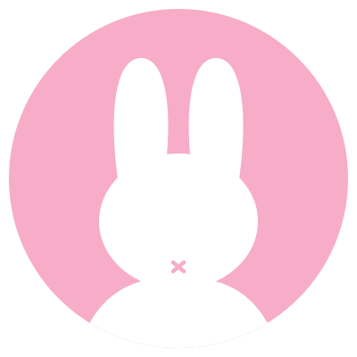

<!-- SEO Metadata & Social Graph -->
<meta name="description" content="Pinkie Theme — An elegant, soothing pastel-pink and soft-white color palette & design tokens crafted for code editors, terminals, note-taking apps, and pink lovers.">
<meta name="keywords" content="pinkie, pinkie theme, pastel pink theme, cozy theme, aesthetic color scheme, vscode pink theme, obsidian pink theme, neovim colorscheme, terminal theme, design tokens, nord-inspired, catppuccin, rose pine, developer aesthetics">
<meta name="author" content="cmduyeen">
<meta property="og:title" content="Pinkie Theme — Soothing Pastel Pink Color Palette">
<meta property="og:description" content="An elegant, soft pastel-pink and cozy color palette crafted for code editors, terminals, and pink lovers.">
<meta property="og:image" content="https://raw.githubusercontent.com/pinkie-theme/pinkie-theme/main/assets/logo.svg">
<meta property="og:url" content="https://github.com/pinkie-theme/pinkie-theme">
<meta property="og:type" content="website">
<meta name="twitter:card" content="summary">
<meta name="twitter:title" content="Pinkie Theme — Soothing Pastel Pink Color Palette">
<meta name="twitter:description" content="An elegant, soft pastel-pink and cozy color palette crafted for code editors, terminals, and pink lovers.">
<meta name="twitter:image" content="https://raw.githubusercontent.com/pinkie-theme/pinkie-theme/main/assets/logo.svg">

  

<h1 align="center">Pinkie</h1>

  A gentle pastel-pink and soft-white theme crafted for pink lovers.

  
  

---

### Philosophy

**Pinkie** pairs soothing pastel pinks with gentle soft whites—crafted for pink lovers seeking a calm, aesthetic workspace.

- **Calmness** ── Soft pink tones naturally soothe the nervous system, reducing tension during long hours.
- **Positivity** ── Evokes a light, uplifting mood that brings subtle joy to your daily workflow.
- **Ergonomics** ── Delicate contrast eliminates screen glare, keeping your eyes refreshed and relaxed.

---

### Palette

<b>Surfaces &amp; Base</b>

 

|  |  |  |  |  |  |
| :---: | :---: | :---: | :---: | :---: | :---: |
| **Canvas** `#fffdfd` | **Surface** `#fff6fa` | **Elevated** `#ffeff6` | **Border** `#f1d3e2` | **Text** `#453b43` | **Muted** `#786c76` |

<b>Accents &amp; Syntax</b>

 

|  |  |  |  |  |  |  |  |
| :---: | :---: | :---: | :---: | :---: | :---: | :---: | :---: |
| **Primary** `#d44b8b` | **Rose** `#c4377a` | **Lavender** `#6a5acd` | **Berry** `#c71d5f` | **Magenta** `#b21f5f` | **Plum** `#a84079` | **Mint** `#2f9e88` | **Coral** `#ff7a59` |

Design tokens are available in [src/pinkie.json](src/pinkie.json) and [src/pinkie.css](src/pinkie.css).

---

### Ports

<b>Code Editors &amp; Development</b>

 

 ── In Progress

 ── Planned

 ── Planned

 ── Planned

 ── Planned

<b>Note-Taking &amp; Knowledge</b>

 

 ── Active

 ── Planned

 ── Planned

<b>Terminals &amp; CLI</b>

 

 ── Planned

 ── Planned

 ── Planned

 ── Planned

 ── Planned

 ── Planned

<b>Desktop &amp; Window Managers</b>

 

 ── Planned

 ── Planned

 ── Planned

 ── Planned

 ── Planned

<b>Browsers &amp; Communication</b>

 

 ── Planned

 ── Planned

 ── Planned

 ── Planned

 ── Planned

<b>Media &amp; Creativity</b>

 

 ── Planned

 ── Planned

 ── Planned

 ── Planned

 ── Planned

---

### License

- [MIT License](LICENSE) — Free and open-source.
- Copyright © 2026 [cmduyeen](https://github.com/cmduyeen) — Pinkie Suite.

---

### The Story Behind

> Following a period of illness and mental health struggles, I discovered how much gentle pink tones helped soothe my mind and uplift my spirits. Realizing how few themes cater thoughtfully to women and pink lovers in developer spaces, I created **Pinkie** with kindness and care.
>
> My hope is simply to bring warmth and a little daily joy to your workspace.  
> *Take gentle care of yourself, and always remember to **love yourself**.* 🌸

  

